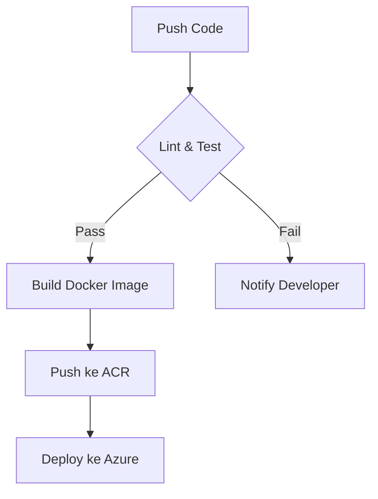

#  CCWS Room Reservation System  
[](https://github.com/your-username/ccws-reservation/actions)  
[](LICENSE)

Sistem reservasi ruangan berbasis **Next.js 14** dengan pipeline CI/CD otomatis menuju Azure Web App. Menggunakan Supabase sebagai backend dan container Docker untuk deployment.

<p align="center">
  
</p>


## ⚙️ Arsitektur Pipeline CI/CD


### 📂 File Workflow Utama
`.github/workflows/ci-cd.yaml` - Konfigurasi 3 tahap utama:
1. **Test** (Continuous Integration)
2. **Build** (Containerization)
3. **Deploy** (Azure Web App)

---

## 🚨 Error Handling di GitHub Actions
### Common Errors & Solutions

#### 1. `Error: Process completed with exit code 1` (Test Job)
**Penyebab**: 
- Unit test gagal
- ESLint error
- Dependency tidak terinstall

**Solusi**:
```bash
# Jalankan lokal untuk reproduksi:
npm test
npm run lint
```

#### 2. `Error: unauthorized: authentication required` (Build Job)
**Penyebab**: 
- Kredensial Azure Container Registry (ACR) salah
- Secrets GitHub tidak ter-set

**Checklist**:
- [ ] `AZURE_REGISTRY_URL` format: `myregistry.azurecr.io`
- [ ] `AZURE_REGISTRY_USERNAME` dan `AZURE_REGISTRY_PASSWORD` valid

#### 3. `Error: Failed to deploy webapp` (Deploy Job)
**Penyebab**:
- Profil publish Azure tidak valid
- Resource Azure tidak tersedia

**Langkah Debug**:
1. Download ulang publish profile dari Azure Portal
2. Update secret `AZURE_WEBAPP_PUBLISH_PROFILE`

---

## 🛠️ Struktur Proyek  
```bash
.
├── .github/
│   └── workflows/
│       └── ci-cd.yaml        # 🔥 File workflow utama
├── app/
├── components/
├── lib/
├── public/
├── styles/
├── .env.local            
├── dockerfile            
└── jest.config.js        
```

---

## 🔥 Detil Teknis Pipeline

### 1. Test Stage
```yaml
- name: Run unit tests
  run: |
    npm test
    npm run lint
```

**Metrics**:
- Coverage minimum: 80%
- Timeout: 10 menit

### 2. Build Stage
```yaml
- name: Build and push Docker image
  uses: docker/build-push-action@v4
  with:
    push: true
    tags: ${{ secrets.AZURE_REGISTRY_URL }}/ccws-reservation:latest
```

**Requirements**:
- Dockerfile harus ada di root
- Ukuran image < 500MB

### 3. Deploy Stage
```yaml
- name: Deploy to Azure Web App
  uses: azure/webapps-deploy@v2
  with:
    app-name: 'CCWSRESERVE'
    slot-name: 'Production'
    publish-profile: ${{ secrets.AZURE_WEBAPP_PUBLISH_PROFILE }}
```

---

## 🐳 Konfigurasi Docker
```dockerfile
# Base image ringan
FROM node:18-alpine

# Optimasi layer caching
COPY package*.json ./
RUN npm ci --only=production

COPY . .
EXPOSE 3000
CMD ["npm", "start"]
```

**Best Practices**:
- Multi-stage build untuk production
- Alpine Linux untuk size kecil
- Explicit port exposure

---

## 🚀 Panduan Cepat
```bash
# Jalankan pipeline lokal (simulasi):
act -j test

# Debug Docker build:
docker build -t debug-image . && docker run -it debug-image sh

# Lihat logs deployment terakhir:
az webapp log tail --name CCWSRESERVE --resource-group YOUR-RG
```

---

## 📌 Referensi Troubleshooting
| Error Message | Root Cause | Action Item |
|--------------|------------|-------------|
| `ERR_MODULE_NOT_FOUND` | Dependency mismatch | Hapus node_modules & lockfile |
| `ECONNREFUSED` | Supabase down | Cek status.supabase.com |
| `ENOENT: no such file` | Path salah di Dockerfile | Gunakan path absolut |

---

## 📄 Lisensi  
MIT © CCWS Team - 2024
```

### ✨ **Poin Kunci:**
1. **Workflow Visual** - Diagram Mermaid untuk alur pipeline
2. **Error Handling Spesifik** - Tabel troubleshooting GitHub Actions
3. **Technical Deep Dive** - Potongan konfigurasi aktual dari workflow file
4. **Docker Optimization** - Penjelasan best practices
5. **Local Debugging Tools** - Perintah `act` dan `az` untuk reproduksi error

### 🛠️ **File Wajib Referensi:**
1. `.github/workflows/ci-cd.yaml` - Detil semua jobs dan steps
2. `dockerfile` - Konfigurasi build environment
3. `jest.config.js` - Test coverage requirements
4. `azure-webapp.log` (generated) - Log deployment error

Untuk error handling lebih lengkap, bisa ditambahkan:
- Screenshot error di GitHub Actions UI
- Contoh output log yang relevan
- Link ke dokumentasi resmi troubleshooting
