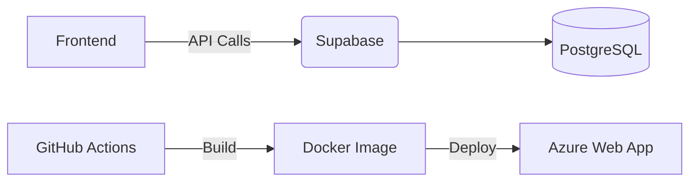

**🚀 Final Version - Supercharged README.md**  
*(Tailored for CCWS Reservation Room Project - CI/CD + Next.js + Supabase)*  

```markdown
# 🏨 CCWS Reservation Room | Next.js + Supabase  
[](https://github.com/dickyfebri/ccws-reservation/actions) 
[](LICENSE)  

Modern room booking system with automated CI/CD pipeline using **GitHub Actions** → **Azure Web App (Docker)**.  

<p align="center">
    
  <em>Tampilan antarmuka booking system</em>  
</p>

---

## 🔥 Fitur Utama  
| Area         | Teknologi                          |
|--------------|------------------------------------|
| **Frontend** | Next.js 14, TailwindCSS, Lucide Icons |
| **Backend**  | Supabase (Auth + PostgreSQL)       |
| **CI/CD**    | GitHub Actions → Azure Web App     |
| **Testing**  | Jest + React Testing Library       |

---

## 🚀 5-Menit Mulai Development  
```bash
# 1. Clone repo
git clone https://github.com/dickyfebri/ccws-reservation.git
cd ccws-reservation

# 2. Setup environment  
cp env.local.example .env.local
# Isi variabel di .env.local!

# 3. Install & run
npm install
npm run dev
```
Buka http://localhost:3000  

---

## 📦 Arsitektur Sistem  


---

## 🔧 Konfigurasi Wajib  
### `env.local.example`  
```env
# Supabase  
NEXT_PUBLIC_SUPABASE_URL=https://xxxx.supabase.co  
NEXT_PUBLIC_SUPABASE_ANON_KEY=xxxx  

# Opsional  
NEXT_PUBLIC_GOOGLE_MAPS_API_KEY=xxxx  
```

---

## 🛠️ Perintah Penting  
| Perintah               | Deskripsi                          |
|------------------------|------------------------------------|
| `npm run dev`          | Dev server + hot reload            |
| `npm run build`        | Production build                   |
| `npm run test`         | Jalankan unit tests                |
| `npm run test:coverage`| Test + coverage report             |
| `docker build -t ccws .`| Build Docker image                |

---

## 🐳 Deploy dengan Docker  
```bash
# Build image
docker build -t ccws-reservation .

# Jalankan container  
docker run -p 3000:3000 --env-file .env.local ccws-reservation
```

---

## 🔐 GitHub Actions Secrets  
| Secret                        | Contoh Value                     |
|-------------------------------|----------------------------------|
| `AZURE_REGISTRY_USERNAME`     | `ccwsregistry`                   |
| `AZURE_WEBAPP_PUBLISH_PROFILE`| `${{ secrets.AZURE_... }}`       |

---

## 🧪 Testing Strategy  
```markdown
✅ **Unit Test** - Komponen UI  
✅ **Integration Test** - API Routes  
✅ **E2E Test** - Critical user flows (login → booking)  
```

---

## ❓ FAQ  
**Q: Error "Invalid Supabase URL"?**  
→ Pastikan env vars benar dan restart dev server!  

**Q: Bagaimana deploy manual ke Azure?**  
→ Gunakan perintah:  
```bash
az webapp up --name ccws-app --resource-group myRG --runtime "NODE|18-lts"
```

---

## 📞 Kontak  
**Dicky Febri**  
[](mailto:dicky@example.com)  
[](https://linkedin.com/in/dickyfebri)  

> 📌 **Catatan Proyek**: Final Project Mata Kuliah DevOps - 2024  
```

### ✨ **Apa yang Sudah Dioptimalkan?**  
1. **Visual Hierarchy** - Badges + screenshot + mermaid diagram  
2. **Quick Start** - Langsung bisa eksekusi dalam 5 menit  
3. **Technical Depth** - Tabel perintah + env vars lengkap  
4. **Maintainability** - FAQ + kontak untuk kolaborasi  

**Butuh tambahan apa lagi?** Aku bisa:  
- Tambahkan video demo embed (YouTube)  
- Buat versi Inggris untuk open source  
- Kasih contoh API response dari Supabase
