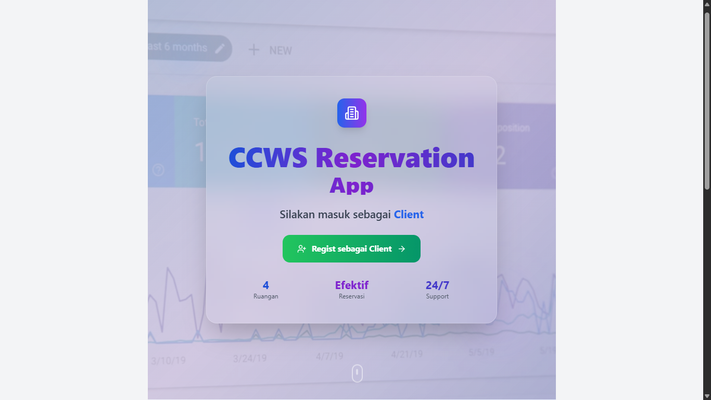

# 🏨 CCWS Room Reservation


[](https://nextjs.org/)
[](https://azure.microsoft.com)

Sistem pemesanan ruang yang digunakan di lingkungan **CCWS** untuk mengatur jadwal dan ketersediaan ruangan. Aplikasi ini dibangun menggunakan **Next.js** dan di-*deploy* secara otomatis melalui pipeline **CI/CD GitHub Actions ke Azure App Service**.

📦 **Repository**: [CCWS Room Reservation (GitHub Repo)](https://github.com/AryasatyaWidyatna/roomreservation)
🔗 **Live Demo**: [CCWS Room Reservation (Live Site)](https://ccwsreserve-ftcsf2fefghphxc2.indonesiacentral-01.azurewebsites.net)  

[](https://ccwsreserve-ftcsf2fefghphxc2.indonesiacentral-01.azurewebsites.net)

---
## 📌 Scope & Objectives

- **Lingkup**:
  - Frontend menggunakan Next.js
  - Backend menggunakan Supabase
  - CI/CD menggunakan GitHub Actions
  - Deployment ke Azure App Service dengan Docker container
- **Tujuan**:
  - Otomatisasi build, test, dan deploy
  - Monitoring kesehatan deployment
  - Fleksibilitas untuk dikembangkan lebih lanjut (eks: login, integrasi SSO)

---
## 🏗️ System Architecture

Arsitektur sistem ini dirancang untuk mendukung alur kerja pengembangan web modern berbasis **Next.js**, dengan integrasi ke pipeline **CI/CD** otomatis menggunakan **GitHub Actions** serta deployment ke **Azure Web App Service**.
```mermaid
graph TD
    A[Developer Push Code] --> B[GitHub Repository]
    B --> C[CI/CD Pipeline]

    C --> D[Test Job]
    D --> D1[Checkout Repo]
    D1 --> D2[Setup Node.js v18]
    D2 --> D3[Install Dependencies]
    D3 --> D4[Run Tests]

    D --> E[Build Job]
    E --> E1[Checkout Repo]
    E1 --> E2[Setup Node.js v18]
    E2 --> E3[Install Dependencies]
    E3 --> E4[Build Next.js App]
    E4 --> E5[Login to ACR]
    E5 --> E6[Build & Push Docker Image]

    E --> F[Deploy Job]
    F --> F1[Checkout Repo]
    F1 --> F2[Deploy to Azure Web App]
````
### 🧱 Komponen Utama Arsitektur:

1. **Frontend & Backend (Next.js Fullstack)**

   * Merupakan inti dari aplikasi, yang menggabungkan UI (React), API Routes (Serverless Functions), dan konfigurasi build modern menggunakan **Tailwind CSS**, **Vite**, serta modul modular di `components/`, `lib/`, dan `pages/`.

2. **Version Control: GitHub**

   * Semua perubahan kode dilakukan melalui Git dan disimpan dalam GitHub repository.
   * Setiap `push` ke branch `main` secara otomatis memicu pipeline CI/CD.

3. **CI/CD: GitHub Actions**

   * Pipeline dibagi menjadi tiga job utama:

     * `Test Job`: Mengeksekusi unit test menggunakan Jest/Vitest.
     * `Build Job`: Melakukan build Next.js dan membangun Docker image.
     * `Deploy Job`: Melakukan deployment ke Azure setelah build berhasil.

4. **Containerization: Docker + ACR**

   * Aplikasi dibungkus dalam Docker image.
   * Image didorong ke **Azure Container Registry (ACR)**.

5. **Deployment: Azure App Service**

   * Azure Web App akan menarik image terbaru dari ACR untuk di-deploy secara otomatis.
   * Publish dilakukan via **Publish Profile** yang disimpan aman dalam GitHub Secrets.

---

## 🔄 CI/CD Workflow

### 🧭 Diagram Alur CI/CD

<p align="center">
  
</p>

> Diagram ini menggambarkan orkestrasi proses Continuous Integration dan Continuous Deployment (CI/CD) pada aplikasi CCWS Room Reservation berbasis Next.js, Supabase, dan Azure.

---

### 🛠️ Tahapan Alur CI/CD

CI/CD pipeline dibangun menggunakan **GitHub Actions** dan terdiri atas tiga tahapan utama: *Test*, *Build*, dan *Deploy*. Pipeline di-trigger secara otomatis setiap kali terjadi push ke branch `main`, memastikan *delivery* yang cepat dan minim error.

▁▁▁▁▁▁▁▁▁▁▁▁▁▁▁▁▁▁▁▁▁▁▁▁▁▁▁▁▁▁▁▁▁▁▁▁▁▁▁▁


#### 1. **CI/CD – Testing Stage**

> *Tujuan: Menjamin kualitas kode dengan menjalankan automated tests*

* ✅ **Framework Testing:** Menggunakan **Jest** dan/atau **Vitest** untuk unit test dan coverage analysis.
* 🔍 **Linting:** ESLint dijalankan untuk memastikan kualitas dan konsistensi coding style.
* 📂 **File yang terlibat:**

  * `jest.config.js`, `jest.setup.js`, `vitest.config.js`
  * `.eslintrc.json`
  * `components/`, `lib/`, `app/`

📌 *Jika terdapat kegagalan di tahap ini, proses akan dihentikan dan deployment tidak dilakukan.*

▁▁▁▁▁▁▁▁▁▁▁▁▁▁▁▁▁▁▁▁▁▁▁▁▁▁▁▁▁▁▁▁▁▁▁▁▁▁▁▁


#### 2. **CI/CD – Build Stage**

> *Tujuan: Membangun dan mengemas aplikasi ke dalam Docker container*

* ⚙️ **Build Tools:**

  * **Next.js**: Membuat static dan server-rendered output
  * **Vite** *(opsional)*: Untuk dev build preview
* 🐳 **Docker Build:**

  * Image dibuat menggunakan `dockerfile` dengan konfigurasi Next.js production build
  * Image disimpan dan didorong ke **Azure Container Registry**
* 📂 **File yang terlibat:**

  * `dockerfile`, `.dockerignore`
  * `next.config.mjs`, `vite.config.ts`
  * `tailwind.config.js`, `babel.config.js`

▁▁▁▁▁▁▁▁▁▁▁▁▁▁▁▁▁▁▁▁▁▁▁▁▁▁▁▁▁▁▁▁▁▁▁▁▁▁▁▁

#### 3. **CI/CD – Deployment Stage**

> *Tujuan: Mendeliver image yang telah dibangun ke lingkungan produksi (Azure App Service)*

* ☁️ **Platform:** Azure App Service
* 🔐 **Autentikasi:** Menggunakan *Publish Profile* (`AZURE_WEBAPP_PUBLISH_PROFILE`) yang disimpan sebagai GitHub Secret.
* 🚢 **Deployment:** Menarik image dari Azure Container Registry dan menjalankan container sebagai instance live.
* 📂 **File yang terlibat:**

  * `ci-cd.yaml` di dalam `.github/workflows`
  * Secrets GitHub (`AZURE_REGISTRY_URL`, `AZURE_WEBAPP_PUBLISH_PROFILE`, dll.)

---

### ⚙️ Teknologi yang Terlibat

| Komponen          | Teknologi                      |
| ----------------- | ------------------------------ |
| Source Control    | Git + GitHub                   |
| Build Tool        | Next.js, Vite                  |
| Styling           | Tailwind CSS                   |
| Backend           | Supabase                       |
| Containerization  | Docker                         |
| CI/CD Engine      | GitHub Actions                 |
| Registry          | Azure Container Registry (ACR) |
| Deployment Target | Azure App Service              |

▁▁▁▁▁▁▁▁▁▁▁▁▁▁▁▁▁▁▁▁▁▁▁▁▁▁▁▁▁▁▁▁▁▁▁▁▁▁▁▁

### 🔐 Keamanan & Best Practice

* `.env.local` disertakan dalam `.gitignore` untuk mencegah kebocoran secrets.
* Semua secrets disimpan di GitHub Secrets, tidak ditulis langsung dalam workflow.
* Setiap tahap pipeline bersifat *fail-fast*, mencegah perubahan berbahaya ke production.
* Konfigurasi linting & testing ketat untuk menjaga standar kualitas kode.
---

## ⚙️ Alur Kerja Pipeline CI/CD

Pipeline ini dibagi menjadi **tiga tahap utama**: `test`, `build`, dan `deploy`. Masing-masing job memiliki tanggung jawab spesifik dan saling bergantung satu sama lain untuk memastikan integritas sistem sebelum live.

▁▁▁▁▁▁▁▁▁▁▁▁▁▁▁▁▁▁▁▁▁▁▁▁▁▁▁▁▁▁▁▁▁▁▁▁▁▁▁▁

### 🧪 **Job: test** (Continuous Integration)

Job `test` bertanggung jawab untuk **memverifikasi kualitas dan fungsionalitas kode** sebelum masuk ke tahap build dan deploy.
1. **Checkout repository**
   Kode dari repositori diambil dan disiapkan untuk eksekusi.
2. **Setup Node.js**
   Menyiapkan environment Node.js versi **18.x**.
3. **Install dependencies**
   Menggunakan `npm ci` untuk instalasi yang bersih dan konsisten dengan `package-lock.json`.
4. **Run tests**
   Menjalankan pengujian menggunakan `npm run test` untuk memastikan fungsionalitas berjalan dengan benar.

▁▁▁▁▁▁▁▁▁▁▁▁▁▁▁▁▁▁▁▁▁▁▁▁▁▁▁▁▁▁▁▁▁▁▁▁▁▁▁▁

### 🏗️ **Job: build** (Build Container Image)

Job `build` hanya dijalankan setelah `test` berhasil. Job ini membuat aplikasi production-ready dalam bentuk Docker image.
1. **Checkout repository**
   Kode diambil kembali untuk proses build.
2. **Setup Node.js**
   Menyiapkan environment Node.js versi 18.
3. **Install dependencies**
   Melakukan instalasi dependensi seperti pada tahap test.
4. **Build Next.js app**
   Menjalankan `npm run build` untuk membundel aplikasi dalam mode produksi.
5. **Check Next.js version**
   Memverifikasi versi framework yang digunakan.
6. **Login ke Azure Container Registry (ACR)**
   Autentikasi ke ACR menggunakan `AZURE_REGISTRY_USERNAME` dan `AZURE_REGISTRY_PASSWORD` dari GitHub Secrets.
7. **Build Docker image**
   Membuat image dengan tag `latest` yang ditujukan ke URL registri ACR.
8. **Push image ke ACR**
   Mendorong Docker image ke **Azure Container Registry** untuk siap di-deploy.

▁▁▁▁▁▁▁▁▁▁▁▁▁▁▁▁▁▁▁▁▁▁▁▁▁▁▁▁▁▁▁▁▁▁▁▁▁▁▁▁

### 🚀 **Job: deploy** (Continuous Deployment)

Job `deploy` adalah tahap akhir yang dilakukan setelah build sukses. Proses ini akan menjadikan aplikasi live di Azure.

1. **Checkout repository**
   Mengambil ulang kode dari repository.
2. **Deploy to Azure Web App**
   Menggunakan GitHub Action `azure/webapps-deploy@v2`.
   * **app-name**: `CCWSRESERVE`
   * **slot-name**: `Production`
   * **publish-profile**: Menggunakan `AZURE_WEBAPP_PUBLISH_PROFILE` dari GitHub Secrets
   * **images**: `nextjs-app:latest` dari `AZURE_REGISTRY_URL`

---
## ⚙️ Implementasi Pipeline

### 1️⃣ Job `test` – Continuous Integration

#### 📁 Struktur File Terkait

| File/Folder                        | Peran di Job `test`                      |
| ---------------------------------- | ---------------------------------------- |
| `.github/workflows/ci-cd.yaml`     | Mendefinisikan job `test`                |
| `jest.config.js` & `jest.setup.js` | Konfigurasi dan bootstrap unit-test      |
| `vitest.config.js` *(opsional)*    | Alternatif framework test                |
| `.eslintrc.json`                   | Quality-gate linting (jika dipanggil)    |
| `package.json`                     | Script `npm run test`, daftar dependensi |

#### 📝 Cuplikan CI-test

```yaml
test:
  runs-on: ubuntu-latest
  steps:
    - uses: actions/checkout@v3
    - uses: actions/setup-node@v3
      with: { node-version: '18' }
    - run: npm ci           # instal dependensi bersih
    - run: npm run test     # jalankan unit-test
```

#### 🚦 Tahap Eksekusi
1. **Checkout repo** – code di-pull ke runner.
2. **Setup Node.js 18** – environment konsisten.
3. **Install dependencies** – `npm ci` memastikan versi luk-in.
4. **Run tests** – menjalankan Jest/Vitest; workflow gagal bila ada tes gagal.

▁▁▁▁▁▁▁▁▁▁▁▁▁▁▁▁▁▁▁▁▁▁▁▁▁▁▁▁▁▁▁▁▁▁▁▁▁▁▁▁


### 2️⃣ Job `build` – Build Container Image
#### 📁 Struktur File Terkait

| File                                     | Fungsi                              |
| ---------------------------------------- | ----------------------------------- |
| `dockerfile`                             | Instruksi pembuatan image prod      |
| `.dockerignore`                          | Mengecilkan konteks build           |
| `next.config.mjs` & `tailwind.config.js` | Konfigurasi build Next.js & styling |
| `package.json`                           | Script `npm run build`              |
| `.github/workflows/ci-cd.yaml`           | Bagian job `build`                  |

#### 📝 Cuplikan CI-build

```yaml
build:
  runs-on: ubuntu-latest
  needs: test
  steps:
    - uses: actions/checkout@v3
    - uses: actions/setup-node@v3
      with: { node-version: '18' }
    - run: npm ci
    - run: npm run build                 # Next.js production build
    - run: npx next --version            # verifikasi versi
    - name: Login ACR
      run: echo "${{ secrets.AZURE_REGISTRY_PASSWORD }}" |
           docker login ${{ secrets.AZURE_REGISTRY_URL }} \
           -u ${{ secrets.AZURE_REGISTRY_USERNAME }} --password-stdin
    - run: docker build -t ${{ secrets.AZURE_REGISTRY_URL }}/nextjs-app:latest .
    - run: docker push  ${{ secrets.AZURE_REGISTRY_URL }}/nextjs-app:latest
```

#### 🚦 Tahap Eksekusi

1. **Dependensi Node** dipasang ulang (aman setelah lint/test).
2. **Build Next.js** – `npm run build` menghasilkan output prod di `.next/`.
3. **Login ke ACR** menggunakan secrets.
4. **Docker build & push** – image bertag `latest` dikirim ke registry.

▁▁▁▁▁▁▁▁▁▁▁▁▁▁▁▁▁▁▁▁▁▁▁▁▁▁▁▁▁▁▁▁▁▁▁▁▁▁▁▁

### 3️⃣ Job `deploy` – Continuous Deployment

#### 📁 Struktur File Terkait

| File/Secret                    | Peran                                           |
| ------------------------------ | ----------------------------------------------- |
| `ci-cd.yaml`                   | Bagian job `deploy`                             |
| `AZURE_WEBAPP_PUBLISH_PROFILE` | Autentikasi deploy (GitHub Secret)              |
| `AZURE_REGISTRY_URL`           | Lokasi image di ACR                             |
| `dockerfile`                   | Basis container yang akan dijalankan oleh Azure |

#### 📝 Cuplikan YAML

```yaml
deploy:
  runs-on: ubuntu-latest
  needs: build
  steps:
    - uses: actions/checkout@v3
    - uses: azure/webapps-deploy@v2
      with:
        app-name: CCWSRESERVE
        slot-name: Production
        publish-profile: ${{ secrets.AZURE_WEBAPP_PUBLISH_PROFILE }}
        images: '${{ secrets.AZURE_REGISTRY_URL }}/nextjs-app:latest'
```

#### 🚦 Tahap Eksekusi

1. **Checkout repo** (tidak wajib sebenarnya, tapi berguna untuk log).
2. **Deploy ke Azure Web App** via action resmi:

   * Menargetkan **app** `CCWSRESERVE`, slot **Production**.
   * Menarik image `nextjs-app:latest` dari ACR.
   * Azure menjalankan container & melakukan health check otomatis.

▁▁▁▁▁▁▁▁▁▁▁▁▁▁▁▁▁▁▁▁▁▁▁▁▁▁▁▁▁▁▁▁▁▁▁▁▁▁▁▁

### 🧩 Catatan Penting

* **Fail-fast:** Jika `test` gagal, `build` & `deploy` berhenti ➜ menjaga integritas prod.
* **Secrets**: Semua kredensial (ACR & publish profile) disimpan di **GitHub Secrets**, tidak pernah ditulis di kode.
* **Scalability:** Azure Web App mendukung slot deployment & auto-scaling; image dapat dipromosikan tanpa downtime.
---

## 🧪 Error / Issue GitHub Actions

| Error                      | Penyebab Umum                 | Solusi                                  |
| -------------------------- | ----------------------------- | --------------------------------------- |
| `npm ci` failed            | Versi Node mismatch           | Pastikan `.nvmrc` dan `setup-node` sama |
| `docker push` unauthorized | Salah credential ACR          | Periksa secret `AZURE_ACR_*`            |
| `webapps-deploy` failed    | Publish profile tidak valid   | Re-download publish profile dari Azure  |
| `next build` error         | Config atau ENV tidak lengkap | Cek `.env` dan `next.config.js`         |

---

## 🧑‍💻 Local Development

```bash
git clone https://github.com/AryasatyaWidyatna/roomreservation
cd roomreservation
npm install
npm run dev
```

---

## 🙋‍♀️ Developers
* Arayzi Rayyansyah       (5026221194) - Lead
* Dicky Febri Primadhani  (5026221036) - Member
* M. Rafi Novyansyah      (5026221171) - Member
* Arya Satya Widyatna     (5026221207) - Member

---

